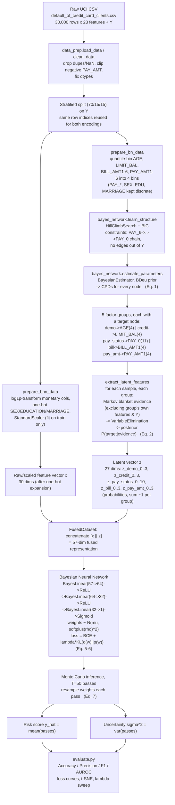

# Methodology: From 23 Raw Features to Latent Factors to Risk Prediction

This document explains, in one place, how this repository's code maps onto the paper
*"Uncertainty-Aware Robust Financial Risk Discrimination via Bayesian Network and Bayesian
Neural Modeling"* (`papers/Uncertainty-AwareRobustFinancialRiskDiscriminationviaBayesianNetworkandBayesianNeuralModeling.pdf`),
what the "latent features" actually are, how the 23 UCI features get turned into them, and —
directly — why the pipeline concatenates those latent features back with the raw 23 features
instead of using one or the other alone.

It complements `README.md` (which documents the code file-by-file) and `replication_plan.md`
(the original planning document). This file is the conceptual/architectural explainer.

---

## 1. What the paper actually proposes

The paper's core idea is a **two-stage probabilistic pipeline**:

1. **Stage 1 — Bayesian Network (BN):** a graphical model over the raw features that learns
   *which features statistically depend on which*, and produces, for every sample, a small set
   of **posterior probability distributions** `z` — not a point estimate, a distribution — over
   groups of related variables. This is the interpretable, structure-aware half.
2. **Stage 2 — Bayesian Neural Network (BNN):** a feed-forward network where every weight is a
   *distribution* instead of a single number (Bayes-by-Backprop / variational inference). It
   consumes a **fused vector** of raw features + BN posteriors and outputs both a risk
   probability and an uncertainty (variance) via Monte Carlo sampling at inference time.

Paper equations, as implemented:

```
Stage 1 (BN):        p(z | G) = Π p(zᵢ | Pa(zᵢ))                      ... Eq. 1
                      p(y | x) = Σ_z p(y | z, x) · p(z | G)            ... Eq. 2

Stage 3 (BNN loss):  L_task = -log p(y | x)                            (BCE)
                      L = L_task + λ · KL(q(w) ‖ p(w))                 ... Eq. 5-6

Stage 4 (inference): ŷ   = (1/T) Σₜ ŷₜ                                 (risk score)
                      Var = (1/T) Σₜ (ŷₜ - ŷ)²                         (uncertainty)  ... Eq. 7
```

`G` = the DAG structure learned by the BN. `z` = the latent posterior vector. `Pa(zᵢ)` = parents
of node `zᵢ` in the DAG. `q(w)` = learned variational posterior over BNN weights, `p(w)` = the
Gaussian prior.

> **Note on scope:** `docs/Abstract.md` in this repo describes a *further-extended* version of
> this idea that also inserts a Graph Neural Network before the BN (producing embeddings `H`
> that would be fused as `[H ‖ Z]`). **That GNN stage is not implemented in `src/`.** The actual
> code (`src/bayes_network.py`, `src/bnn_model.py`) implements the paper's original two-stage
> BN → BNN design, fusing *raw scaled features* `x` with BN posteriors `z`, i.e. `[x ‖ z]`. This
> document describes what the code does, and flags the `H` extension as future work in §6.

---

## 2. The dataset and its 23 raw features

Source: UCI *Default of Credit Card Clients* (Yeh & Lien, 2009), 30,000 Taiwanese credit-card
accounts, binary target `Y` = default next month.

| # | Feature(s) | Meaning | Type |
|---|---|---|---|
| 1 | `LIMIT_BAL` | Credit limit (NT$) | Continuous |
| 2 | `SEX` | Gender | Categorical |
| 3 | `EDUCATION` | Education level | Categorical |
| 4 | `MARRIAGE` | Marital status | Categorical |
| 5 | `AGE` | Age in years | Continuous |
| 6–11 | `PAY_0, PAY_2…PAY_6` | Repayment status, Sep→Apr 2005 (6 months) | Ordinal |
| 12–17 | `BILL_AMT1…6` | Bill statement amounts, Sep→Apr 2005 | Continuous |
| 18–23 | `PAY_AMT1…6` | Amount actually paid, Sep→Apr 2005 | Continuous |

That's **23 input features** total (24 columns including `Y`, 25 including the dropped `ID`).

These 23 features are **not fed to the two model stages in raw form**. `src/data_prep.py`
derives **two different encodings** of the same 23 features, because the BN and the BNN need
fundamentally different input types:

| Encoding | Why | Used by |
|---|---|---|
| **Discrete/binned** (`prepare_bn_data`) — `AGE`, `LIMIT_BAL`, `BILL_AMT*`, `PAY_AMT*` quantile-binned into 4 buckets each; `PAY_*`, `SEX`, `EDUCATION`, `MARRIAGE` kept as native discrete codes | pgmpy's discrete BN needs categorical/finite-state variables to build CPTs (conditional probability tables) | Stage 1 (BN) |
| **Continuous/scaled** (`prepare_bnn_data`) — monetary columns log-transformed (`sign(x)·log1p(|x|)`), `SEX/EDUCATION/MARRIAGE` one-hot encoded, everything standardized (`StandardScaler`, fit on train only) | A neural network needs real-valued, roughly-normalized inputs; log-transform tames the heavy-tailed monetary columns, one-hot avoids imposing false ordinal structure on categoricals | Stage 3 (BNN), as the raw-feature half of the fusion (30 columns after one-hot expansion) |

Both encodings are built from **the exact same train/val/test row indices** (stratified 70/15/15
split on `Y`) so that later, row `i` in the discrete file, the continuous file, and the latent-`z`
file all refer to the same client.

---

## 3. Stage 1 in detail: how the 23 features become latent factors

This is the part you asked about specifically. Implemented in `src/bayes_network.py`.

### 3.1 Step 1 — Group the 23 features into 5 factor groups

The 23 features are not treated individually by the BN's *output* side — they're grouped into
5 semantically meaningful clusters, each with one designated **target node**:

| Group | Target node | Member features | # posterior states |
|---|---|---|---:|
| `demo` | `AGE` | `SEX, EDUCATION, MARRIAGE, AGE` | 4 (AGE's 4 quantile bins) |
| `credit` | `LIMIT_BAL` | `LIMIT_BAL` | 4 |
| `pay_status` | `PAY_0` | `PAY_0, PAY_2, PAY_3, PAY_4, PAY_5, PAY_6` | 11 (PAY_0's discrete repayment codes) |
| `bill` | `BILL_AMT1` | `BILL_AMT1…BILL_AMT6` | 4 |
| `pay_amt` | `PAY_AMT1` | `PAY_AMT1…PAY_AMT6` | 4 |

`4 + 4 + 11 + 4 + 4 = 27` — this is where the "27 latent dimensions" comes from.

### 3.2 Step 2 — Learn the DAG structure (`learn_structure`)

`HillClimbSearch` (BIC score) searches over possible edges between **all 23 raw discrete
features + Y**, subject to two hard constraints (`ExpertKnowledge`):

- **Required edges:** `PAY_6 → PAY_5 → PAY_4 → PAY_3 → PAY_2 → PAY_0` (enforces the real
  temporal ordering of repayment history — April before May before … before September).
- **Forbidden edges:** nothing may point *out of* `Y` (the label can be an effect of features,
  never a cause of them).

The result is a DAG `G` over 24 nodes (23 features + `Y`) capturing which features are
statistically predictive of which others, learned entirely from the **training split's discrete
data**.

### 3.3 Step 3 — Fit CPDs (`estimate_parameters`)

`BayesianEstimator` with a BDeu prior (equivalent sample size 10) computes a conditional
probability table for every node given its parents in `G`. This is Eq. (1): `p(z | G) = Π p(zᵢ | Pa(zᵢ))`.

### 3.4 Step 4 — Extract the latent posteriors (`extract_latent_features`)

This is the actual "23 features → latent features" conversion, and it works like this **for
every sample, for every one of the 5 groups**:

1. Take the group's **target node** (e.g. `AGE` for `demo`).
2. Find its **Markov blanket** in the learned DAG `G` — i.e. its parents, children, and
   children's other parents — the minimal set of variables that fully determines its
   distribution.
3. Build an **evidence dictionary** from that sample's actual raw feature values, but **only
   using Markov-blanket variables that are *not* in the target's own factor group, and not `Y`**.
4. Run exact inference (`VariableElimination`) to compute the posterior
   `P(target_node = state | evidence)` for every possible state of the target node.
5. That probability vector — e.g. 4 numbers summing to ~1 for `demo` — becomes that sample's
   `z_demo_0 … z_demo_3`. Repeat for all 5 groups → 27 numbers per sample.
6. If evidence produces an unseen combination pgmpy can't resolve, it falls back to the node's
   marginal prior, then to a uniform distribution — this is a robustness fallback, not the
   normal path.

Column naming: `z_{group}_{state_index}`, e.g. `z_pay_status_7` = posterior probability that
`PAY_0` is in repayment-status state index 7, given the sample's Markov-blanket evidence.

**The crucial detail:** step 3 *excludes the group's own features from the evidence*. So
`z_demo` (the posterior over `AGE`) is **not** computed from `SEX, EDUCATION, MARRIAGE, AGE`
themselves — it's computed from whatever *other* variables (credit limit, repayment history,
bill/payment amounts) happen to sit in `AGE`'s Markov blanket. In effect, each `z_group` answers:
*"Given everything **else** we know about this client, what does the network expect this
group's target variable to look like?"* That is a **cross-consistency check**, not a restatement
of the group's own raw values.

### 3.5 Why do this at all, instead of just binning and stopping?

- A raw discrete bin (`AGE = 2`) is a hard, lossy label. A posterior vector
  (`z_demo = [0.05, 0.12, 0.61, 0.22]`) is a **soft, calibrated belief** that also encodes how
  *confident* the network is and how *consistent* this client's other attributes are with a
  typical value for that group — information a single bin can't carry.
- It's the mechanism that gives the pipeline interpretability: you can point at a DAG edge and a
  CPD and explain *why* `z_pay_status` shifted for a given client, unlike an opaque embedding.
- It maps directly onto the paper's Eq. (1)–(2): the BN's job is exactly to produce `p(z|G)`
  as an intermediate structured representation before classification, not to be the final
  classifier itself (a plain discrete BN classifier would be too low-capacity/lossy for this
  task — see §11 caveats in `README.md`).

---

## 4. Stage 2: Fusion — and directly answering "why combine them with the raw 23 again?"

`src/bnn_model.py::FusedDataset` builds each sample's model input as:

```
X_fused = [ x_continuous (30 dims: scaled/log/one-hot raw features) ‖ z (27 dims: BN posteriors) ]
        = 57 dimensions
```

Your objection is legitimate and worth stating precisely: **`z` is computed entirely from a
subset of the same 23 raw features** (via the Markov-blanket evidence), so in a strict
information-theoretic sense, concatenating `x` and `z` cannot give the BNN access to any
information that wasn't already recoverable from `x` alone. Nothing "new" is created. So why
not just feed `x`, or just feed `z`, alone? A few real reasons this pipeline (and the paper)
does it anyway:

1. **`z` is a different, non-linear *view* of the same information, not a duplicate of it.**
   `x` is per-feature and marginal (this client's `AGE` bin, this client's `PAY_0` code, in
   isolation). `z` is per-*group* and *conditional* (what the rest of the client's profile implies
   about that group, filtered through the learned DAG and CPDs). A plain feed-forward BNN layer
   could in principle learn to approximate this itself from `x` alone — but only with enough
   capacity, data, and training signal to rediscover the DAG's conditional structure implicitly.
   Handing it `z` directly **injects that structure as an explicit, pre-computed feature**
   instead of hoping gradient descent reconstructs it. This is standard practice in "hybrid"
   pipelines: an engineered/aggregated feature is not *new* information, but it changes the
   function the downstream model has to learn (linear read-off vs. re-deriving a joint
   distribution), which usually helps a small network with an imbalanced, noisy label.

2. **`z` is deliberately excludes each group's own raw evidence (§3.4), so it is not a
   restatement of `x`.** `z_demo` is a function of the *other four groups'* raw values, not of
   `SEX/EDUCATION/MARRIAGE/AGE`. So `[x ‖ z]` is really `[x_demo, x_credit, …, x_pay_amt] ‖
   [f(x_credit,x_pay_status,x_bill,x_pay_amt), f(x_demo,x_pay_status,x_bill,x_pay_amt), …]` — a
   concatenation of raw values with *cross*-group conditional summaries, which is closer to
   feeding both "the fact" and "what everything else predicts the fact should be" — a
   discrepancy the BNN can use directly (e.g. a client whose payment behavior implies an older,
   more established profile than their stated `AGE`/`EDUCATION` suggests may be a subtle risk
   signal).

3. **`z` and `x` are lossy in *different* ways, and combining them hedges both losses.** `x`'s
   continuous columns are exact but the BN never sees them (it only ever sees the coarse 4-bin
   discretization). `z` is derived entirely from the coarse, binned world and is smoothed by a
   BDeu prior (small counts get pulled toward the prior). So `x` keeps the fine-grained
   continuous detail that `z` throws away in binning; `z` keeps the structured joint-dependency
   information that a per-feature `x` vector doesn't expose to a shallow 2-hidden-layer network.

4. **This is literally the fusion the paper specifies.** Eq. (2), `p(y|x) = Σ_z p(y|z,x)·p(z|G)`,
   is explicit that the final classifier conditions on **both** `x` and `z` jointly — the BN is
   framed as producing an *auxiliary* structured signal that augments the raw features, not a
   replacement for them. This repo's `replication_plan.md` and `README.md` both describe this
   as "Stage 2 — Fusion" for exactly that reason.

**Where your skepticism is most valid:** in this repository's actual implementation, the "other"
half of the fusion is just the scaled/one-hot raw features — there's no GNN-derived embedding
`H` (see §1's note) that would bring in genuinely different information (e.g. neighborhood
structure from a similarity graph over clients). `docs/Abstract.md`'s extended proposal fuses
`[H ‖ Z]` instead of `[x ‖ z]`, which would be a stronger argument for "combining two
non-redundant views." As implemented today, the honest characterization is: **`z` is a
compressed, cross-group, DAG-structured, denoised re-encoding of (most of) `x`, and fusing it
with `x` is a feature-engineering choice — trading some redundancy for injecting explicit
relational structure the small BNN would otherwise have to learn on its own** — not a source of
strictly new information. Ablating it (train the same BNN on `x` alone, 30-dim input) is a cheap
experiment worth running if you want empirical evidence either way; nothing in the current
`src/` does that ablation yet.

---

## 5. Stage 3–4: Bayesian Neural Network and Monte Carlo inference

Implemented in `src/bnn_model.py` and `src/evaluate.py`.

- **Architecture:** `BayesLinear(57→64) → ReLU → BayesLinear(64→32) → ReLU → BayesLinear(32→1) → Sigmoid`.
- **`BayesLinear`:** every weight/bias is parameterized by `(μ, ρ)`; `σ = softplus(ρ) = log(1+e^ρ)`;
  each forward pass samples `w = μ + σ·ε`, `ε ~ N(0,1)` (reparameterization trick), and
  accumulates a closed-form KL divergence against a zero-mean Gaussian prior `N(0, σ²_prior=0.1²)`.
- **Loss:** `L = BCE(ŷ, y) + λ·KL_total`, λ = 1e-4 by default (Eq. 5–6). Trained with Adam,
  lr=0.001, 100 epochs, batch size 128/256.
- **Inference (Eq. 7):** at test time, T=50 stochastic forward passes are drawn (weights
  resampled each pass). The **risk score** is the mean prediction across passes; the
  **uncertainty** is the variance across passes — this variance is *epistemic* uncertainty
  coming from weight uncertainty, not just prediction noise.
- **Evaluation:** Accuracy/Precision/F1/AUROC on the held-out test fused vectors, plus a loss
  curve, a t-SNE of the 57-dim fused space colored by class with high-variance points flagged,
  and a λ-sensitivity sweep (AUROC vs. KL weight on a log scale).

---

## 6. Full workflow diagram



Text-only version of the same flow, if diagrams don't render in your viewer:

```
Raw CSV (30,000 x 23 features + Y)
   │
   ├─ clean_data (drop dupes/NaN, clip negatives, fix dtypes)
   │
   ├─ stratified split (70/15/15, same row indices reused below)
   │
   ├──────────────► prepare_bn_data (quantile-bin continuous cols)
   │                        │
   │                        ▼
   │                Discrete train/val/test CSVs (24 cols)
   │                        │
   │                        ▼
   │                learn_structure (HillClimbSearch + BIC,
   │                temporal PAY chain + no-edges-from-Y constraints)
   │                        │
   │                        ▼
   │                estimate_parameters (BayesianEstimator, BDeu)
   │                        │
   │                        ▼
   │                5 factor groups x Markov-blanket evidence
   │                        │
   │                        ▼
   │                extract_latent_features (VariableElimination)
   │                        │
   │                        ▼
   │                Latent z CSVs — 27 posterior-probability dims/sample
   │                        │
   └──────────────► prepare_bnn_data (log1p + one-hot + StandardScaler)
                            │
                            ▼
                    Continuous train/val/test CSVs (30 feature cols + Y)
                            │
                            ▼
              FusedDataset: concat [x (30) ‖ z (27)] = 57-dim input
                            │
                            ▼
              Bayesian Neural Network (BayesLinear x3, KL-regularized)
                            │
                            ▼
              MC inference, T=50 stochastic forward passes
                            │
                  ┌─────────┴─────────┐
                  ▼                   ▼
          risk score ŷ (mean)   uncertainty σ² (variance)
                            │
                            ▼
              evaluate.py: Accuracy/Precision/F1/AUROC,
              loss curves, t-SNE, λ-sensitivity sweep
```

---

## 7. Quick reference: dimension bookkeeping

| Object | Dims | Built by | Meaning |
|---|---:|---|---|
| Raw features | 23 | UCI source | Demographics(4) + credit(1) + repayment(6) + bills(6) + payments(6) |
| Discrete BN input | 23 (+Y) | `prepare_bn_data` | Same 23, continuous ones quantile-binned to 4 levels |
| Continuous BNN raw input `x` | 30 (+Y) | `prepare_bnn_data` | 23 features after one-hot expansion of SEX/EDUCATION/MARRIAGE |
| Latent posteriors `z` | 27 | `extract_latent_features` | 5 group-wise posterior distributions (4+4+11+4+4) over BN target nodes |
| Fused BNN input | 57 | `FusedDataset` | `x` (30) concatenated with `z` (27) |

---

## 8. Summary answer to "why combine them"

Because the paper's formulation (Eq. 2) explicitly conditions the classifier on `(x, z)` jointly,
and because `z` — despite being derived from a subset of `x` — is a *structurally different*,
denoised, cross-group-conditional re-encoding (not a copy) of the client's profile that a shallow
BNN would otherwise have to re-derive itself from `x` alone. It is not adding new *information*
in the Shannon sense; it is adding an explicit, DAG-structured *feature transformation* of
existing information, and it deliberately excludes each factor group's own raw values from its
own posterior to avoid literal duplication. The most defensible way to make it "not redundant"
in the fullest sense — as this repo's own `docs/Abstract.md` proposes — is to replace the raw
`x` half of the fusion with GNN-derived neighborhood embeddings `H`, which would carry
genuinely external (relational/inter-client) information the BN's per-client posteriors cannot
see. That extension is not yet implemented in `src/`.
